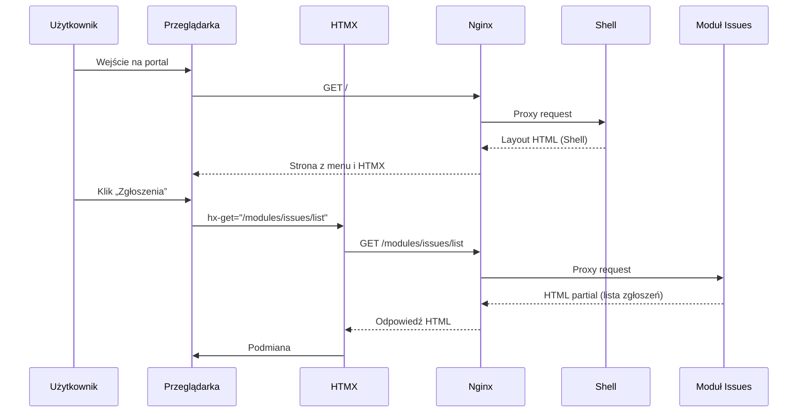
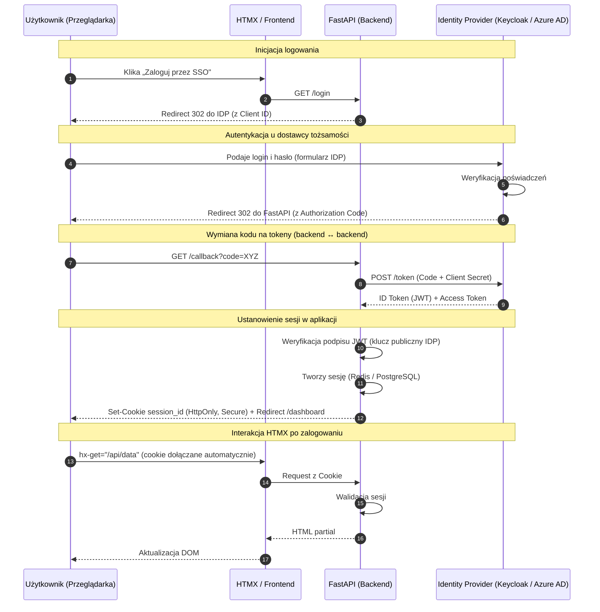

# IT Project OS — Dokumentacja architektoniczna (Modular HTMX)

## 1. Cel systemu
IT Project OS to modułowa platforma wspierająca realizację projektów IT w środowisku produkcyjnym. Architektura opiera się na podejściu **micro-frontends + microservices**, gdzie:
- `Shell` dostarcza wspólny layout, nawigację i kontekst użytkownika,
- moduły domenowe (np. `Issues`, `Kanban`, `Dokumentacja`) działają jako niezależne usługi,
- interakcje UI realizowane są przez **HTMX** i zwracane jako fragmenty HTML.

## 2. Założenia architektoniczne
- Niezależne wdrażanie modułów bez konieczności przebudowy całego systemu.
- Spójny UX dzięki wspólnym zasobom statycznym i stylom.
- Prosty routing i agregacja usług przez jedną bramę (`Nginx`).
- Minimalizacja logiki frontendowej JavaScript na rzecz renderowania po stronie serwera.

## 3. Stos technologiczny
- **Backend (Shell + moduły):** Python 3.11+, FastAPI, Jinja2
- **Frontend:** HTMX 2.0, Tailwind CSS, DaisyUI
- **Gateway / Routing:** Nginx (reverse proxy)
- **Konteneryzacja:** Docker, Docker Compose
- **Baza danych:** PostgreSQL

## 4. Widok architektury
```mermaid
flowchart LR
    U[Użytkownik / Przeglądarka] --> G[Nginx Gateway]
    G --> S[Shell FastAPI]
    G --> I[Module Issues FastAPI]
    G --> K[Module Kanban FastAPI]
    G --> D[Module Dokumentacja FastAPI]

    S --> DB[(PostgreSQL)]
    I --> DB
    K --> DB
    D --> DB

    G --> ST[/static]
```

## 5. Przepływ żądania HTMX


## 6. Struktura projektu (MVP)
```text
/it-portal-root
├── docker-compose.yml            # Orkiestracja kontenerów
├── nginx.conf                    # Routing i reverse proxy
├── /static                       # Wspólne zasoby CSS/JS
│   └── style.css                 # Zbudowany Tailwind
├── /shell                        # Aplikacja główna (menu, auth, layout)
│   ├── main.py
│   └── templates/index.html
└── /module-issues                # Moduł zgłoszeń
    ├── main.py
    └── templates/list.html
```

## 7. Przykładowe konfiguracje i komponenty

### 7.1 Docker Compose (`docker-compose.yml`)
```yaml
version: "3.8"
services:
  gateway:
    image: nginx:alpine
    ports:
      - "5050:80" # Porty dla użytkowników zewnętrznych z puli 5050-5080
    volumes:
      - ./nginx.conf:/etc/nginx/nginx.conf:ro
      - ./static:/usr/share/nginx/html/static:ro

  shell:
    build: ./shell
    container_name: shell

  module-issues:
    build: ./module-issues
    container_name: module-issues
```

Porty użytkownika dla narzędzi administracyjnych PostgreSQL:
- `pgAdmin 4`: `http://localhost:5080`
- `Adminer`: `http://localhost:5081`
- `CloudBeaver`: `http://localhost:5082`

Kontenery `shell`, `module-issues`, `postgres`, `pgadmin`, `adminer`, `cloudbeaver` korzystają z głównego pliku `.env` przez `env_file`.

### 7.2 Konfiguracja Nginx (`nginx.conf`)
```nginx
events {}

http {
    include /etc/nginx/mime.types;

    server {
        listen 80;

        # Shell (layout i nawigacja)
        location / {
            proxy_pass http://shell:8000;
        }

        # Routing modułu Issues
        location /modules/issues/ {
            proxy_pass http://module-issues:8000/;
        }

        # Zasoby statyczne
        location /static/ {
            alias /usr/share/nginx/html/static/;
        }
    }
}
```

### 7.3 Layout Shell (`shell/templates/index.html`)
```html
<!DOCTYPE html>
<html lang="pl" data-theme="corporate">
<head>
    <meta charset="UTF-8">
    <meta name="viewport" content="width=device-width, initial-scale=1.0">
    <title>IT Project OS</title>
    <link href="/static/style.css" rel="stylesheet">
    <script src="https://unpkg.com/htmx.org@2.0.0"></script>
</head>
<body class="flex h-screen bg-base-200">
    <aside class="w-64 bg-base-100 p-4 shadow-lg">
        <h1 class="text-xl font-bold p-2 text-primary">IT OS</h1>
        <ul class="menu w-full mt-4">
            <li>
                <a hx-get="/modules/issues/list" hx-target="#main-content">
                    📋 Zgłoszenia
                </a>
            </li>
            <li><a class="disabled text-base-content/30">📊 Kanban (wkrótce)</a></li>
        </ul>
    </aside>

    <main id="main-content" class="flex-1 p-8">
        <h2 class="text-3xl font-bold">Witaj w systemie IT</h2>
        <p>Wybierz moduł, aby kontynuować.</p>
    </main>
</body>
</html>
```

### 7.4 Logika modułu (`module-issues/main.py`)
```python
from fastapi import FastAPI, Request
from fastapi.responses import HTMLResponse
from fastapi.templating import Jinja2Templates

app = FastAPI()
templates = Jinja2Templates(directory="templates")


@app.get("/list", response_class=HTMLResponse)
async def get_list(request: Request):
    issues = [{"id": 1, "task": "Awaria PLC", "status": "Nowy"}]
    return templates.TemplateResponse(
        "list.html",
        {"request": request, "issues": issues},
    )
```

## 8. Wytyczne dla deweloperów
- **Fragmenty HTML:** moduły zwracają wyłącznie partiale (bez pełnego dokumentu HTML).
- **Stylizacja:** używamy klas Tailwind i komponentów DaisyUI; unikamy inline CSS.
- **Izolacja modułów:** każdy moduł ma własny kontekst domenowy i własną warstwę danych.
- **HTMX:** używamy `hx-get`, `hx-post`, `hx-target`, `hx-swap` zgodnie z konwencją Shell.
- **Kontrakty URL:** endpointy modułów są prefiksowane przez `/modules/<nazwa-modułu>/...`.

## 9. Zakres MVP
- Shell z nawigacją i obszarem dynamicznej podmiany treści.
- Moduł `Issues` z listą zgłoszeń.
- Jedna brama Nginx kierująca ruch do usług.
- Wspólne zasoby statyczne dla wszystkich modułów.

## 10. Autoryzacja i uwierzytelnianie (OIDC / SSO)

### 10.1 Wybrany standard

Zastosowano **OpenID Connect (OIDC)** — warstwę tożsamości nad OAuth 2.0. Pozwala to na pełną separację logiki biznesowej od zarządzania danymi wrażliwymi (hasła, tokeny).

### 10.2 Architektura rozwiązania

Model: **Authorization Code Flow + PKCE**.

| Komponent | Rola |
|-----------|------|
| **IdP** | Keycloak (domyślnie) lub Azure AD |
| **Backend** | FastAPI — walidator JWKS + BFF (Backend for Frontend) |
| **Frontend** | HTMX korzystający z bezpiecznych ciasteczek (`HttpOnly`, `Secure`) |

### 10.3 Przepływ logowania SSO



### 10.4 Abstrakcja użytkownika (FastAPI)

```python
# FastAPI Dependency — izolacja od konkretnego IdP
async def get_current_user(token_data: dict = Depends(verify_jwt)):
    return UserAdapter(token_data).to_internal_user()
```

### 10.5 Strategia migracji (Keycloak → Azure AD)

#### A. Migracja konfiguracyjna (code-level)

Dzięki OIDC migracja ogranicza się do podmiany **Discovery URL** w konfiguracji FastAPI — kod biznesowy nie wymaga zmian.

#### B. Migracja tożsamości (data-level)

| Metoda | Opis |
|--------|------|
| **Mapowanie po e-mailu** | Najprostsza — łączy stare konta Keycloak z nowymi w Azure AD po adresie e-mail. |
| **Stable Identifier** | W bazie SQL przechowujemy `external_id` w tabeli pośredniej, unikając kaskadowych aktualizacji. |
| **Identity Brokering (hybrid)** | Azure AD jako IdP wewnątrz Keycloaka — stopniowe przenoszenie użytkowników bez zmian w backend. |

### 10.6 Wyzwania techniczne

- **Brak migracji haseł:** eksport haseł z Keycloaka jest niemożliwy; użytkownicy przejdą procedurę „First-time login" lub Reset Password w Azure AD.
- **Synchronizacja atrybutów:** „App Roles" w Azure AD muszą odpowiadać rolom zdefiniowanym w Keycloaku.

### 10.7 Integracja z ekosystemem (Docker / Monitoring)

- **Logi:** zdarzenia autoryzacji wypychane przez FastAPI do InfluxDB (analiza anomalii, brute-force).
- **Docker:** Keycloak jako kontener z osobną bazą PostgreSQL — łatwe backupy przed migracją.

### 10.8 Korzyści architektoniczne

- **Stateless sessions:** skalowalność horyzontalna (K8s-ready).
- **BFF Pattern:** tokeny nigdy nie trafiają do JS — ochrona przed XSS.
- **Vendor Agnostic:** architektura przygotowana na dowolnego dostawcę OIDC.

---

## 11. Kierunki dalszego rozwoju

- Rozszerzenie o moduły `Kanban`, `Dokumentacja`, `Raporty`.
- Wydzielenie osobnych schematów PostgreSQL per moduł.
- Monitoring i observability (logi, metryki, distributed tracing).
- Wdrożenie CI/CD (GitHub Actions / GitLab CI) z automatycznym budowaniem obrazów Docker.