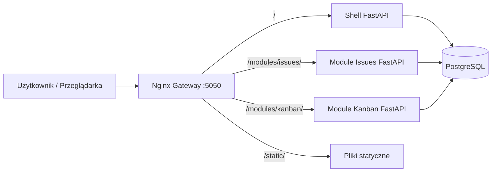
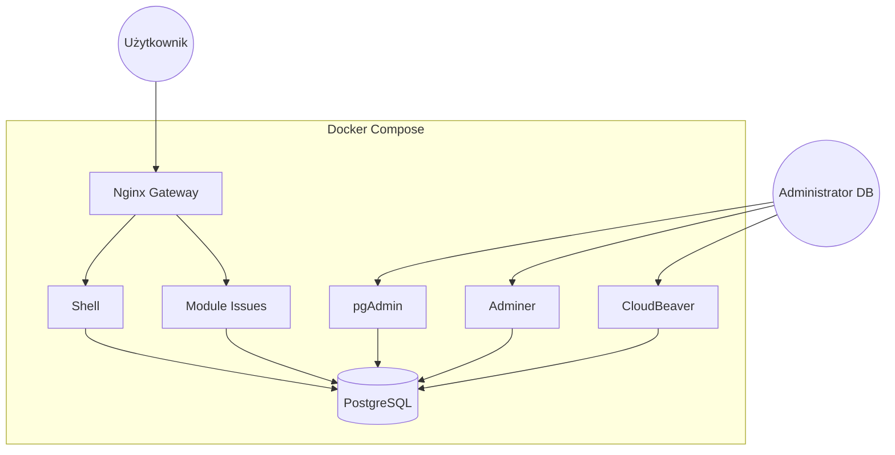
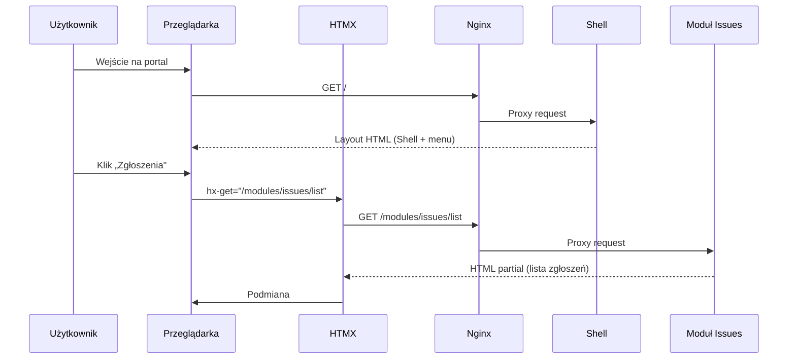
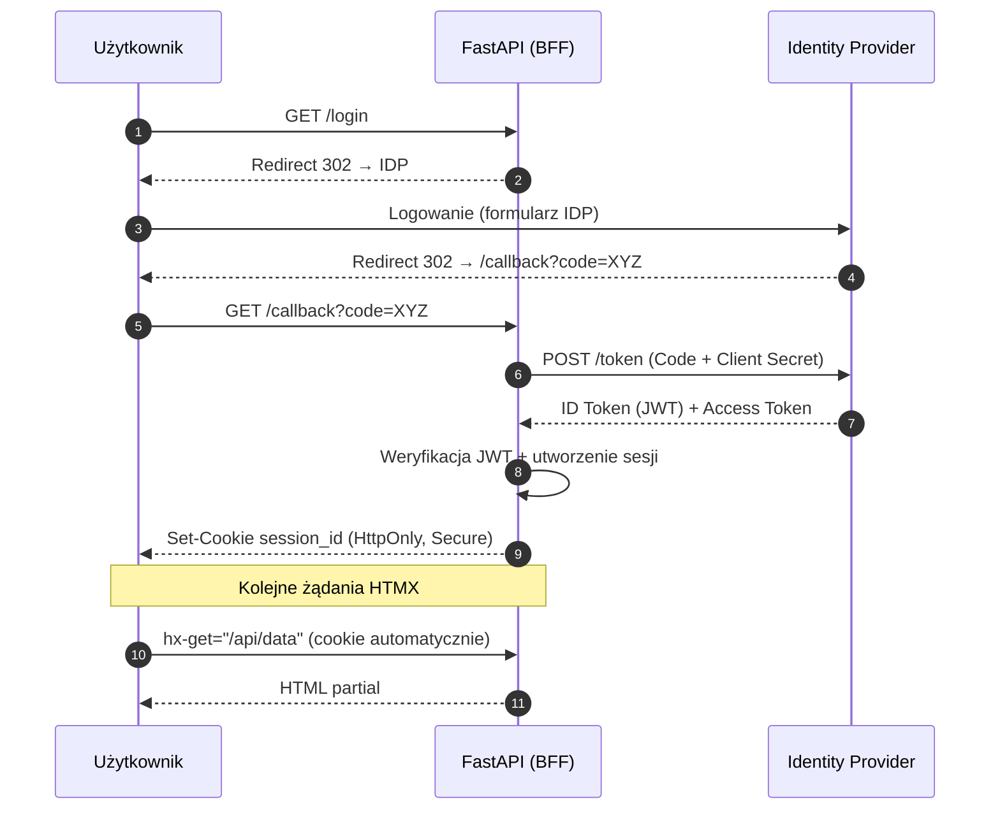
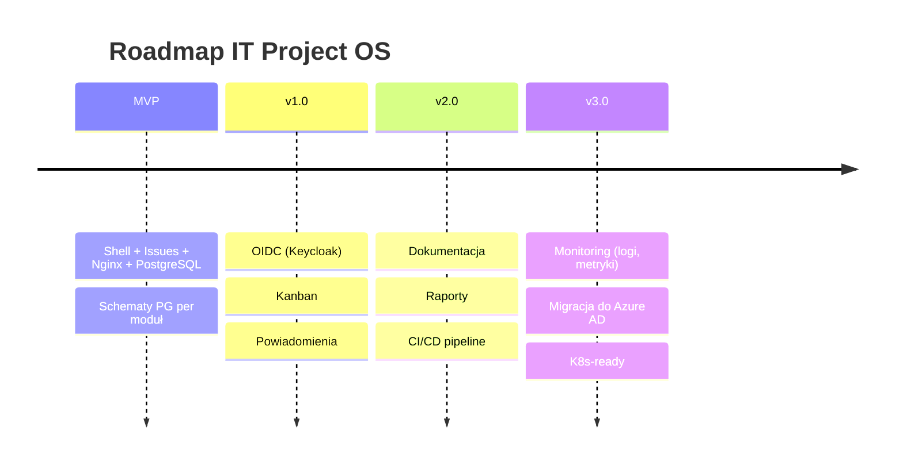

# IT Project OS — Dokumentacja architektoniczna

> Szczegóły technologii i wersji: **TECHSTACK.md** · Wytyczne dla AI/deweloperów: **AGENTS.md**

---

## 1. Cel systemu

IT Project OS to modułowa platforma wspierająca realizację projektów IT.
Architektura **micro-frontends + microservices** pozwala na niezależne wdrażanie modułów domenowych bez przebudowy całego systemu, przy minimalnej logice JavaScript po stronie przeglądarki.

## 2. Kluczowe decyzje architektoniczne

| Decyzja | Uzasadnienie |
|---------|-------------|
| HTMX zamiast SPA (React/Vue) | Prostota, brak build-stepu dla frontendu, renderowanie po stronie serwera |
| Nginx jako brama | Jeden punkt wejścia, routing `/modules/*` do mikroserwisów |
| Moduły zwracają HTML partiale | Izolacja — moduł nie musi znać layoutu Shell |
| OIDC + BFF Pattern | Tokeny nigdy nie trafiają do JS — ochrona przed XSS |
| Osobne schematy PostgreSQL per moduł | Pełna izolacja DDL — `shell.sessions`, `issues.issues` itd. Alembic nigdy nie widzi tabel innych modułów |
| Niezależne migracje Alembic per moduł | Każdy schemat wersjonowany oddzielnie (`alembic_version_*` przechowywana w swoim schemacie) |

## 3. Widok architektury



## 4. Infrastruktura kontenerowa



## 5. Przepływ żądania HTMX



## 6. Autoryzacja OIDC / SSO

Model: **Authorization Code Flow + PKCE** z wzorcem BFF.



### Strategia migracji IdP (Keycloak → Azure AD)

| Metoda | Opis |
|--------|------|
| **Zmiana Discovery URL** | Kod biznesowy bez zmian — wystarczy podmiana konfiguracji |
| **Mapowanie po e-mailu** | Łączenie kont między dostawcami po adresie e-mail |
| **Identity Brokering** | Azure AD jako IdP wewnątrz Keycloaka — migracja stopniowa |

## 7. Struktura projektu

```text
/PROJEKTY
├── docker-compose.yml          # Orkiestracja kontenerów
├── nginx.conf                  # Reverse proxy / routing
├── .env                        # Zmienne środowiskowe (NIE commitować)
├── AGENTS.md                   # Wytyczne dla AI / deweloperów
├── TECHSTACK.md                # Stos technologiczny (źródło prawdy)
│
├── /static                     # Wspólne zasoby CSS/JS
│
├── /shell                      # Aplikacja główna (layout, nawigacja, auth)
│   ├── main.py
│   ├── models.py / db.py
│   ├── alembic/                # Migracje (schemat PG: shell, wersja: shell.alembic_version_shell)
│   └── templates/
│
├── /module-issues              # Moduł zgłoszeń
│   ├── main.py
│   ├── models.py / db.py
│   ├── alembic/                # Migracje (schemat PG: issues, wersja: issues.alembic_version_issues)
│   └── templates/
│
└── /tools                      # Konfiguracja narzędzi DB (pgAdmin, CloudBeaver)
```

## 8. Zakres MVP

- Shell z nawigacją i dynamiczną podmianą treści (`#main-content`).
- Moduł `Issues` z listą zgłoszeń.
- Brama Nginx kierująca ruch do odpowiednich usług.
- Wspólne zasoby statyczne (Tailwind + DaisyUI).
- Narzędzia administracji bazy danych (pgAdmin, Adminer, CloudBeaver).

## 9. Kierunki dalszego rozwoju



- Distributed tracing i centralne logowanie.
- Automatyczne budowanie obrazów Docker w CI/CD (GitHub Actions).

---

## 🚀 Development Setup

### Wymagania

- Docker + Docker Compose
- Python 3.11+ (opcjonalnie, do lokalnego uruchamiania testów)
- Node.js 18+ (opcjonalnie, do testów E2E Playwright)

### Szybki start

1. Sklonuj repozytorium i wejdź do katalogu projektu
2. Skopiuj plik z przykładowymi zmiennymi:
   ```bash
   cp .env.example .env
   # Uzupełnij wartości OIDC_CLIENT_SECRET, SECRET_KEY itp.
   ```
3. Uruchom środowisko:
   ```bash
   docker compose up --build
   ```
4. Zainicjalizuj schematy bazy danych:
   ```bash
   bash init_db.sh
   ```
5. Otwórz przeglądarkę: http://localhost:5050

### Porty serwisów

| Serwis | URL |
|--------|-----|
| Aplikacja (Nginx gateway) | http://localhost:5050 |
| Shell (bezpośrednio) | http://localhost:8001 |
| Module Issues (bezpośrednio) | http://localhost:8002 |
| Shell — Swagger UI | http://localhost:8001/docs |
| Module Issues — Swagger UI | http://localhost:8002/docs |
| Keycloak | http://localhost:8080 |
| pgAdmin | http://localhost:5080 |
| Adminer | http://localhost:5081 |
| CloudBeaver | http://localhost:5082 |

### Uruchamianie testów

```bash
# Shell — testy jednostkowe i integracyjne
docker compose run --rm shell pytest -v

# Module Issues — testy jednostkowe i integracyjne
docker compose run --rm module-issues pytest -v

# Shell — testy z pokryciem kodu
docker compose run --rm shell pytest --cov=. --cov-report=term-missing -v

# E2E Playwright (wymaga uruchomionego: docker compose up)
cd shell/tests/e2e
npx playwright install   # jednorazowo — instalacja przeglądarek
npx playwright test      # wszystkie testy E2E
npx playwright test navigation.spec.ts   # tylko nawigacja
npx playwright test issues-crud.spec.ts  # tylko CRUD Issues
```

### Struktura testów

| Katalog | Typ testów | Opis |
|---------|-----------|------|
| `shell/tests/test_*_unit.py` | Jednostkowe | Czysta logika, bez I/O |
| `shell/tests/test_*_integration.py` | Integracyjne | Endpointy HTTP (httpx.AsyncClient) |
| `shell/tests/e2e/*.spec.ts` | E2E (Playwright) | Scenariusze użytkownika w przeglądarce |
| `module-issues/tests/test_*_unit.py` | Jednostkowe | Modele, schematy, CRUD |
| `module-issues/tests/test_endpoints_integration.py` | Integracyjne | Endpointy HTTP modułu |
